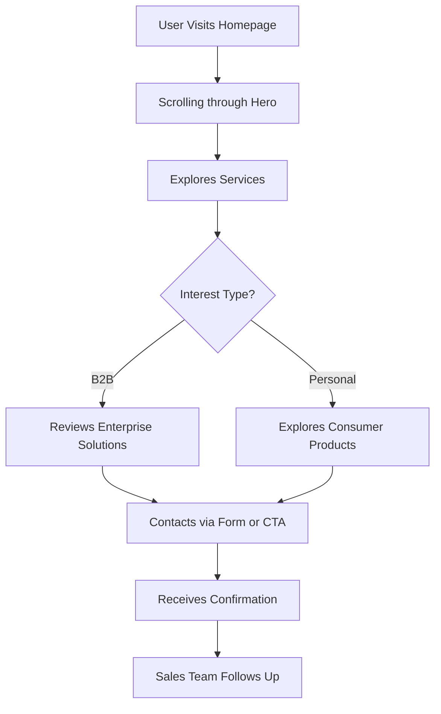
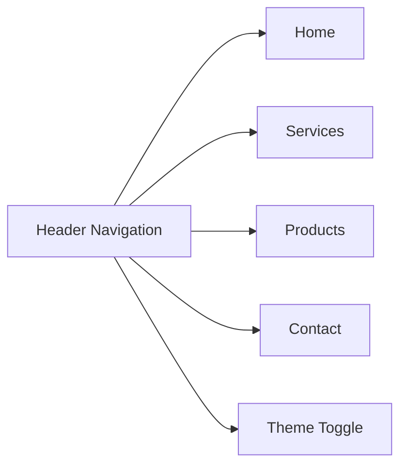

# Gunalabs Website - Product Requirements Document

## 1. Product Overview

Gunalabs is a technology company specializing in application development, digitalization solutions, AI integration, hardware products, and digital products for both B2B enterprise clients and individual consumers.

- **Purpose**: Showcase Gunalabs' capabilities, services, and products while providing a professional gateway for potential B2B partners and individual customers to explore offerings and make contact
- **Target Users**: B2B decision-makers seeking digital transformation partners, individual consumers interested in innovative tech products
- **Market Value**: Position Gunalabs as a forward-thinking, full-spectrum technology partner bridging hardware and software innovation

---

## 2. Core Features

### 2.1 Feature Module

1. **Home page**: Hero section, services overview, products showcase, about section, testimonials, contact CTA
2. **Services page**: Detailed breakdown of each service category (applications, digitalization, AI integration)
3. **Products page**: Showcase hardware and digital products with specifications
4. **Contact page**: Contact form, company information, location

### 2.2 Page Details

| Page Name | Module Name | Feature Description |
|-----------|-------------|---------------------|
| Home | Hero Section | Animated gradient background, bold headline, CTA buttons with hover effects |
| Home | Services Overview | Grid of 5 service cards with icons, hover lift animations |
| Home | Products Showcase | Featured products carousel/slider with smooth transitions |
| Home | About Section | Company mission, values with animated statistics |
| Home | Testimonials | Client quotes carousel with fade transitions |
| Home | Contact CTA | Full-width gradient banner with animated particles |
| Home | Footer | Navigation links, social icons, newsletter signup |
| Services | Hero | Page hero with breadcrumb |
| Services | Service Cards | Expandable detailed cards for each service |
| Services | Process | Step-by-step process visualization |
| Products | Hero | Page hero with category filters |
| Products | Product Grid | Filterable product cards with quick view |
| Products | Product Detail | Modal or page with full specifications |
| Contact | Contact Form | Functional form with validation |
| Contact | Company Info | Address, phone, email, working hours |
| Contact | Map Section | Embedded map or stylized location visual |

### 2.3 Theme Toggle

- **Default State**: Light mode (bright mode first)
- **User Control**: Manual toggle button to switch between light and dark themes
- **System Override**: Does NOT follow system preference - persists user choice in localStorage
- **Toggle Position**: Fixed in header, always visible

---

## 3. Core Process

### 3.1 User Journey Flow

### 3.2 Navigation Flow

---

## 4. User Interface Design

### 4.1 Design Style

**Aesthetic Direction**: "Neo-Industrial Futurism" - Clean, geometric layouts with bold typography, accented by subtle tech-inspired textures and gradients. Professional yet innovative.

**Color Palette**:
- Primary: Deep Indigo `#4F46E5`
- Secondary: Electric Cyan `#06B6D4`
- Accent: Warm Orange `#F97316`
- Background Light: Off-white `#FAFAFA`
- Background Dark: Deep Navy `#0F172A`
- Text Light: Charcoal `#1E293B`
- Text Dark: Slate `#E2E8F0`

**Typography**:
- Display: "Clash Display" or "Cabinet Grotesk" (bold, geometric)
- Body: "Satoshi" or "General Sans" (clean, readable)

**Button Style**: Rounded corners (8px), subtle shadows, gradient overlays on hover

**Layout**: 
- Desktop-first approach with fluid grid
- Asymmetric hero sections with overlapping elements
- Card-based content with generous negative space
- Subtle grain texture overlay for depth

**Icons**: Lucide React icons with consistent stroke weight

### 4.2 Page Design Overview

| Page Name | Module Name | UI Elements |
|-----------|-------------|-------------|
| Home | Hero Section | Full-viewport height, animated gradient mesh, floating geometric shapes, large bold headline with gradient text, dual CTA buttons |
| Home | Services | 5-card grid, icon + title + description, hover: scale(1.02) + shadow elevation + border glow |
| Home | Products | Horizontal scroll showcase, product cards with image, name, category tag, hover: image zoom + overlay reveal |
| Home | About | Split layout: text left, animated stats right (count-up numbers), subtle background pattern |
| Home | Testimonials | Large quote typography, client avatar, company name, smooth fade carousel |
| Home | Contact CTA | Full-width gradient banner, floating particle animation, email input + button |
| Home | Footer | 4-column grid: logo+tagline, services links, product links, contact info |
| Services | Service Cards | Expandable accordion-style cards, detailed descriptions, related icons |
| Products | Product Grid | Masonry-style grid, category filter chips, hover quick-view overlay |
| Contact | Form | Floating label inputs, real-time validation, animated submit button |

### 4.3 Responsiveness

- **Desktop**: Full layouts, multi-column grids, large typography
- **Tablet**: Adjusted grids (2 columns), slightly reduced spacing
- **Mobile**: Single column, hamburger menu, touch-optimized buttons (min 44px tap targets)

### 4.4 Animation Philosophy

- **Entrance Animations**: Staggered fade-up on scroll (Intersection Observer)
- **Hover Effects**: Scale transforms, shadow elevations, color transitions
- **Page Transitions**: Smooth fade between routes
- **Micro-interactions**: Button press feedback, input focus glow, toggle slides
- **Performance**: CSS-only animations where possible, GPU-accelerated transforms

---

## 5. Dummy Data Structure

### 5.1 Services Data
1. Application Development - Custom software solutions
2. Digitalization - Business process transformation
3. AI Integration - Machine learning & automation
4. Hardware Products - IoT devices & embedded systems
5. Digital Products - SaaS platforms & mobile apps

### 5.2 Products Data
1. NeuralHub X1 - AI Processing Unit (Hardware)
2. CloudSync Pro - Enterprise sync solution (Digital)
3. DataFlow Analyzer - Business intelligence tool (Digital)
4. EdgeCompute Kit - IoT development platform (Hardware)
5. AutoML Studio - No-code ML platform (Digital)
6. SmartSensor V2 - Environmental monitoring (Hardware)

### 5.3 Testimonials Data
- 4-5 client testimonials with names, roles, companies, quotes

### 5.4 Stats Data
- Projects Completed: 150+
- Happy Clients: 85+
- Team Members: 45+
- Years Experience: 8+
