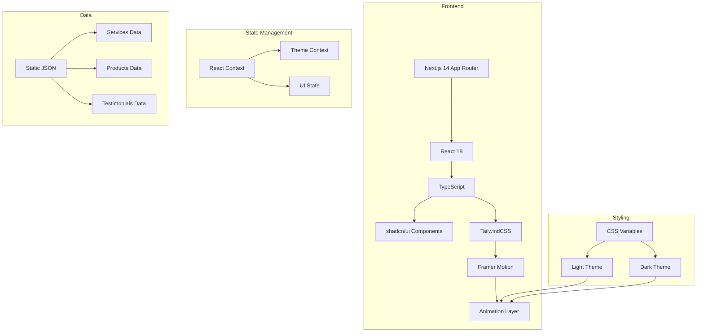

# Gunalabs Website - Technical Architecture

## 1. Architecture Design



## 2. Technology Stack

| Layer | Technology | Version |
|-------|------------|---------|
| Framework | Next.js | 14.x |
| UI Library | React | 18.x |
| Language | TypeScript | 5.x |
| Styling | TailwindCSS | 3.x |
| Components | shadcn/ui | Latest |
| Animation | Framer Motion | 11.x |
| Icons | Lucide React | Latest |
| Fonts | next/font (Google Fonts) | - |

## 3. Project Structure

```
gunalabs/
├── app/
│   ├── layout.tsx          # Root layout with providers
│   ├── page.tsx           # Home page
│   ├── globals.css        # Global styles + theme variables
│   ├── services/
│   │   └── page.tsx       # Services page
│   ├── products/
│   │   └── page.tsx       # Products page
│   └── contact/
│       └── page.tsx       # Contact page
├── components/
│   ├── ui/                # shadcn/ui components
│   ├── layout/
│   │   ├── header.tsx
│   │   ├── footer.tsx
│   │   └── mobile-menu.tsx
│   ├── sections/
│   │   ├── hero.tsx
│   │   ├── services.tsx
│   │   ├── products.tsx
│   │   ├── about.tsx
│   │   ├── testimonials.tsx
│   │   └── contact-cta.tsx
│   ├── theme-provider.tsx
│   └── theme-toggle.tsx
├── data/
│   ├── services.ts
│   ├── products.ts
│   └── testimonials.ts
├── lib/
│   └── utils.ts
├── types/
│   └── index.ts
└── tailwind.config.ts
```

## 4. Route Definitions

| Route | Purpose | Components |
|-------|---------|------------|
| `/` | Home page | Hero, Services, Products, About, Testimonials, Contact CTA, Footer |
| `/services` | Services detail | Hero, Service Cards, Process Steps, Footer |
| `/products` | Products showcase | Hero, Product Grid with filters, Footer |
| `/contact` | Contact page | Hero, Contact Form, Company Info, Footer |

## 5. Theme Implementation

### 5.1 Theme Context
```typescript
type Theme = 'light' | 'dark';

interface ThemeContextType {
  theme: Theme;
  toggleTheme: () => void;
}
```

### 5.2 Theme Storage
- Default: `light`
- Storage: `localStorage` with key `gunalabs-theme`
- System Override: DISABLED (always starts in light mode)
- Persistence: Theme choice saved and restored on page load

### 5.3 CSS Variables
```css
/* Light Theme (Default) */
--background: 250 250 250;
--foreground: 30 41 59;
--primary: 79 70 229;
--secondary: 6 182 212;
--accent: 249 115 22;

/* Dark Theme */
--background: 15 23 42;
--foreground: 226 232 240;
--primary: 129 140 248;
--secondary: 34 211 238;
--accent: 251 146 60;
```

## 6. Component Specifications

### 6.1 Header
- Fixed position, backdrop blur on scroll
- Logo (left), Navigation links (center), Theme toggle (right)
- Mobile: Hamburger menu with slide-in drawer
- Height: 72px desktop, 64px mobile

### 6.2 Hero Section
- Full viewport height (100vh)
- Animated gradient mesh background
- Floating geometric shapes (CSS animations)
- Headline: Gradient text effect
- CTAs: Primary + Secondary button pair

### 6.3 Services Grid
- 5 cards in responsive grid (3 cols desktop, 2 tablet, 1 mobile)
- Icon, title, description per card
- Hover: Scale + shadow elevation + subtle border glow

### 6.4 Products Showcase
- Horizontal scroll container on mobile
- Grid layout on desktop
- Filter by category (All, Hardware, Digital)
- Card: Image, title, category badge, brief description
- Hover: Image zoom, overlay with "View Details"

### 6.5 About Section
- Split layout: Text (60%) | Stats (40%)
- Animated counter for statistics
- Subtle background pattern

### 6.6 Testimonials
- Carousel with auto-play (5s interval)
- Manual navigation dots
- Fade transition between slides

### 6.7 Contact CTA Banner
- Full-width gradient background
- Email input + subscribe button
- Floating particles animation (CSS)

### 6.8 Footer
- 4-column grid (desktop)
- Logo + tagline, Services links, Products links, Contact info
- Social icons row
- Copyright text

## 7. Animation Specifications

### 7.1 Scroll Animations
- Trigger: Intersection Observer (threshold: 0.1)
- Animation: Fade up + translate Y (20px → 0)
- Duration: 600ms
- Easing: ease-out
- Stagger: 100ms between items

### 7.2 Hover Animations
- Scale: 1 → 1.02 (200ms)
- Shadow: elevation increase
- Transitions: 200ms ease

### 7.3 Theme Toggle
- Icon rotation: 180deg (300ms)
- Background color transition: 300ms
- Toggle knob slide: 200ms

### 7.4 Page Load
- Initial fade-in: 400ms
- Staggered content reveal: 100ms intervals

## 8. Responsive Breakpoints

| Breakpoint | Width | Layout |
|------------|-------|--------|
| Mobile | < 640px | Single column, stacked layout |
| Tablet | 640px - 1024px | 2-column grids |
| Desktop | > 1024px | Full layout, multi-column |

## 9. Performance Targets

- Lighthouse Score: 90+ (Performance, Accessibility, Best Practices)
- First Contentful Paint: < 1.5s
- Largest Contentful Paint: < 2.5s
- Cumulative Layout Shift: < 0.1
